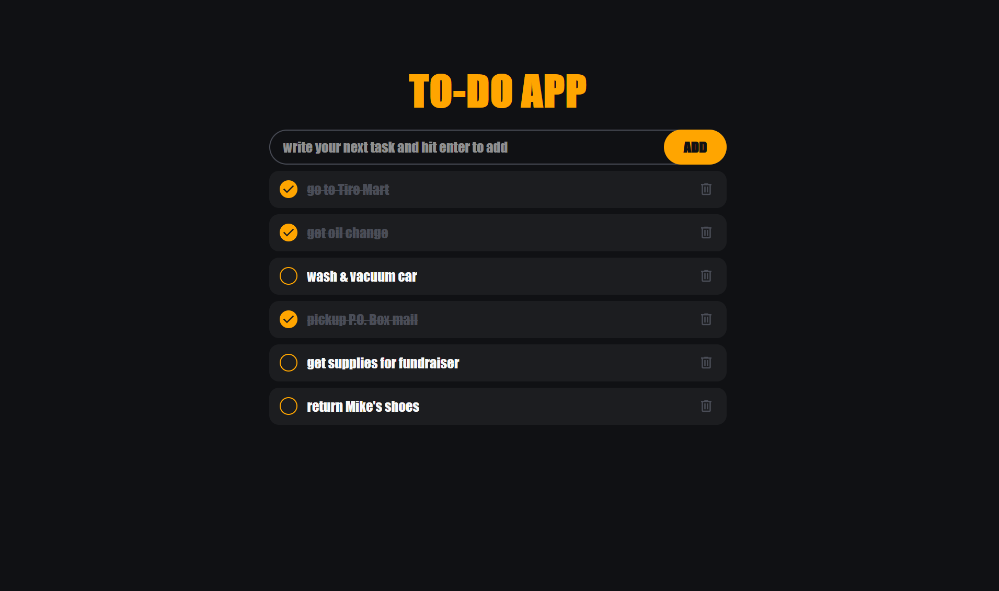
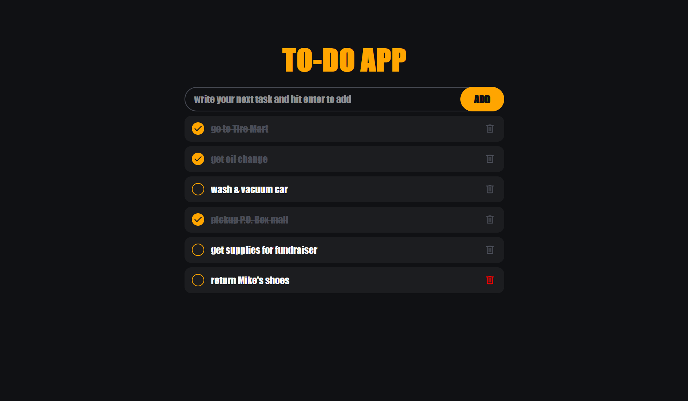
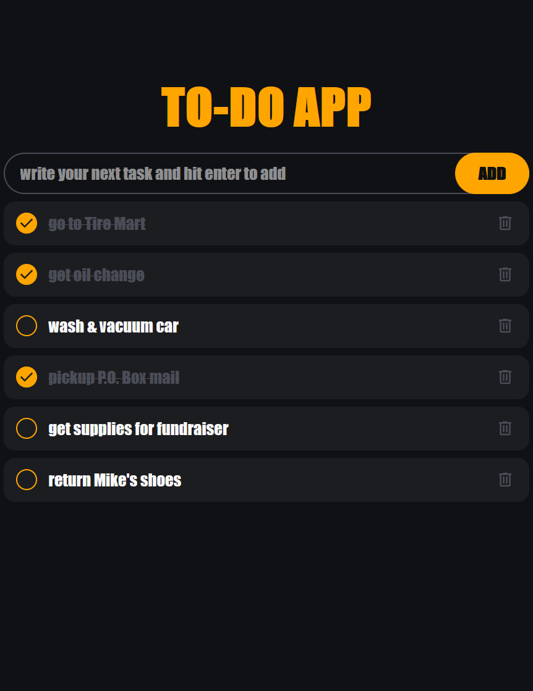

# To-Do App 

Simple and responsive to-do application for multiple form factors. Featuring SVG icons, custom checkbox UI, and a persistent storage using localStorage.


## Features
- Add, delete, and complete tasks

- SVG icons

- Responsive layout

- Animated checkbox

- LocalStorage persistence

## Tech Stack

**HTML** **CSS** **JavaScript**


## Run Locally

Clone the project

```bash
  git clone https://github.com/obiyhan/todo-app-localStorage.git
```

Go to the project directory

```bash
  cd todo-app-localStorage
```

### Open the project
You can open index.html directly in your browser or use VS Code Live Server.
## Color Reference
Here are the colors that I used, try different colors and fonts to customize your to-do app!

| Color             | Hex                                                                |
| ----------------- | ------------------------------------------------------------------ |
| Background Color |  #101114 |
| Primary Color |  #1c1d20 |
| Secondary Color |  #4a4d57 |
| Accent Color |  #ffa500 |
| Text Color |  #f9f9f9 |
| Delete Button SVG Color (hover) |  #ff0000 |


## Screenshots
Here are a few views of the app across different screen sizes and interactions:

### Desktop View



### Hover Over Delete Button Action



### Responsive Desktop View (Split Screen)

## Lessons Learned

- Debugged localStorage issues and improved data persistence  

- Improved responsive design skills  

- Created custom UI components using SVG and CSS